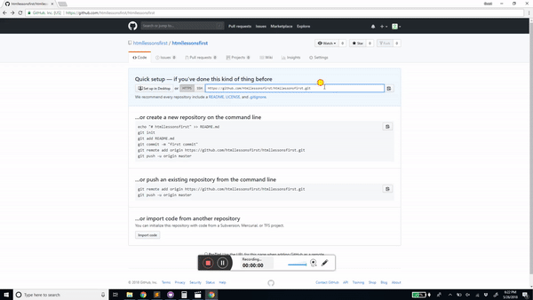

# htmllessons.github.io
## HTML lessons

 
 
<h1>This is a project that will make it easy for you to learn how to create your own FTC or FLL team website!</h1>
 
<h1>Prerequisite programs (all freeware)</h1>
 [-] Sublime text 3  --  sublimetext.com/3
 [-] Google Chrome  --  google.com/chrome
 [-] Github Account  --  github.com (refer to <a href="https://github.com/htmllessons/htmllessons.github.io#creating-a-github-account">below</a> for creating your account)
 [-] Github Desktop  --  desktop.github.com
 
<h1>What we will cover in this introduction to programming</h1>
 [-] Creating a new HTML file and opening it
 [-] Add a header and paragraph
 [-] Use "div's" to break apart your website into a more visually-appealing page
 [-] Use CSS to style your website to make it look awesome
 [-] Use A tags to create a link
 [-] Use Google Anaylitics to gather user information
 
<h1>So lets get started!</h1>
 
<h1>Creating a github account</h1>
 
 [-] Create an account name (preferrably teamnameteamnumber.) Ex: fantasticfive618 <b><u><i>NO CAPITOL LETTERS!</i></u></b>
 [-] Follow the prompts to make an account, leave the plan as it is, otherwise you have to pay, and there is really no reason for us to pay.
 [-] On the survey page you can fill it out or click skip, it does nothing.
 [-] When it redirects you to the page "learn git and github without any code,"
 [-] Go to your email and click varify.
 [-] Click "Start A Project"
 [-] <b>Set repository name to your account name! .github.io</b> Ex: fantasticfive618<i>.github.io</i>
 [-] Give it a description. It says it is optional but I would very strongly reccomend it.
 [-] Leave it as public.
 
 [-] Copy the URL given to you on the page. Should end in .git Ex: https:<i>/</i>/github.com/htmllessonsfirst/htmllessonsfirst.git"
 [-] In Github Desktop, click "File" then "Clone repository"
 [-] Click on URL button, then paste your copied link under "URL or username/repository"
 [-] In Github, change the path to C:\users\{your computer username}\documents\GitHub\{whatever you called your project}  IT SHOULD ALREADY BE LIKE THIS, JUST BE SURE.
 [-] Now, in file explorer, open your documents folder.
 [-] Navigate to GitHub\{whatever you called your project}
 [-] You should be in folder with a hidden or faded folder called ".git" <b>DO NOT <i><u>EVER</u></i> MESS WITH THIS FOLDER OR ANYTHING IN IT!</b>
 
<h1>Creating your first webpage</h1>
 
 [-] Open "Sublime Text 3" (you should have downloaded it earlier, if you didn't, now would be a convient time to do so. It dosen't take too long. You are ready to start coding! 
<pre>
	<code>
&lt;!DOCTYPE html&gt;
	&lt;html&gt;
	&lt;head&gt;
		My team website!
		&lt;link rel="stylesheet" href="style.css"&gt;
	&lt;/head&gt;
		&lt;body&gt;
			&lt;h1&gt;My team website!&lt;/h1&gt;
			&lt;p&gt;Congratulations! you are ready to start coding!&lt;/p&gt;
		&lt;/body&gt;
	&lt;/html&gt;
	</code>
</pre>
 [-] Save the file as <i>index.html</i>
 [-] Navigate back to the folder, and there should be a new file called index.html
 [-] Right-click on it and select "open with" and select "Google Chrome"
 [-] Your file should open on Google Chrome. With the url file:///C:/Users/Jack/Documents/GitHub/{whatever you called your project}/index.html
 [-] Click "file" then "new file" (this can also be achived by clicking <button>Ctrl</button>/<button>Command</button> and <button>n</button>)
<h1>Let's start editing!</h1>
 [-] It is important to know that HTML works with <i>lots</i> angle brackets.
 [-] Each command you type will be inside of angle brackets, and closed with a slash:
<pre><code>
&lt;h1&gt;code goes here&lt;/h1&gt;
&lt;h2&gt;code goes here&lt;/h2&gt;
&lt;h6&gt;code goes here&lt;/h6&gt;
&lt;p&gt;code goes here&lt;/p&gt;
&lt;div&gt;code goes here&lt;/div&gt;
</code></pre>
 [-] And if you know JavaScript, you can imbed it in HTML!
<pre><code>
&lt;script type="text/javascript"&gt;JS code goes here&lt;/script&gt;
</code></pre>
<h1>Time to launch!</h1>
 [-] Open Github Desktop, and you should see your changes. If you don't, click "current repository" in the top left and then click on your repository name.
 [-] In the bottom left, enter stuff into summary, click commit to master. 
 [-] In the top center, click Publish Branch (only the first time) For the second to the billionth and beyond launch, it will say "push origin". They do essentially the same thing.
<h1>Dictionary of terms:</h1> 
<pre><code>
&lt;h1&gt;&lt;/h1&gt;  --  Title, Large font
&lt;h2&gt;&lt;/h2&gt;  --  Subtitle, Large font
&lt;h6&gt;&lt;/h6&gt;  --  The smallest of the "H" family
&lt;p&gt;&lt;/p&gt;  --  Paragraph - use around content of the site
&lt;div&gt;&lt;/div&gt;  --  surround groups of elements with divs to style things such as background, outline color, font, text size, and animations
</code></pre>
<h1>Acknowledgments</h1>
[-] <a href="mailto: 3jbc22@gmail.com">Jack Crane</a>
<h1>License</h1>
[-] Free to use, edit, and redistribute, as long as I am still credited.
